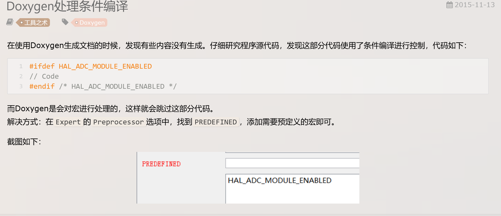

|                                                              |            |
| ------------------------------------------------------------ | ---------- |
| [teedoc](https://teedoc.github.io/get_started/zh/install/index.html) | python lib |
| [mkdocs](https://markdown-docs-zh.readthedocs.io/zh-cn/latest/#_7) | python lib |

Doxygen主要解决说明书问题，可以在我们写代码的时候讲注释转化为说明书，Graphviz主要是用于图形展示，html help workshop主要使用生成CHM文档。
**1.Doxygen**

Doxygen能将程序中的特定批注转换成为说明文件。它可以依据程序本身的结构，将程序中按规范注释的批注经过处理生成一个纯粹的参考手册，通过提取代码结构或借助自动生成的包含依赖图（include dependency graphs）、继承图（inheritance diagram）以及协作图（collaboration diagram）来可视化文档之间的关系， Doxygen生成的帮助文档的格式可以是CHM、RTF、PostScript、PDF、HTML等。

**2.graphviz**

Graphviz(Graph Visualization Software)是一个由AT&T实验室启动的开源工具包,用于绘制DOT语言脚本描述的图形。要使用Doxygen生成依赖图、继承图以及协作图，必须先安装graphviz软件。

[Link](https://graphviz.org/download/)；

**3.HTML Help WorkShop**

微软出品的HTML Help WorkShop是制作CHM文件的最佳工具，它能将HTML文件编译生成CHM文档。Doxygen软件默认生成HTML文件或Latex文件，我们要通过HTML生成CHM文档，需要先安装HTML Help WorkShop软件，并在Doxygen中进行关联

注意：安装完后进行Doxygen配置时需要关联graphviz和HTML Help WorkShop的安装路径。

# 问题

## 预编译的问题

