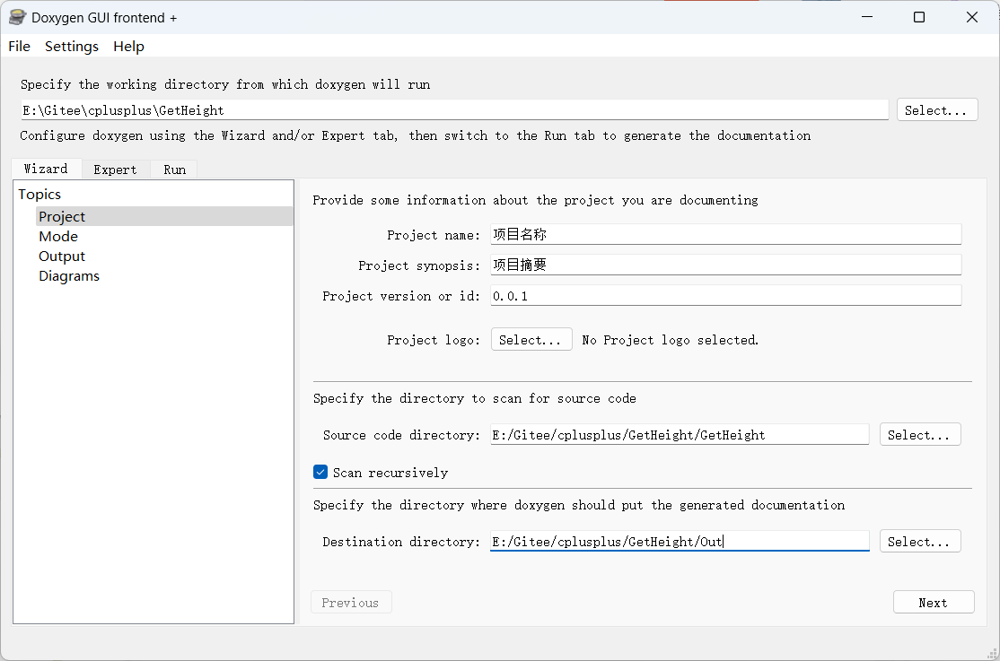
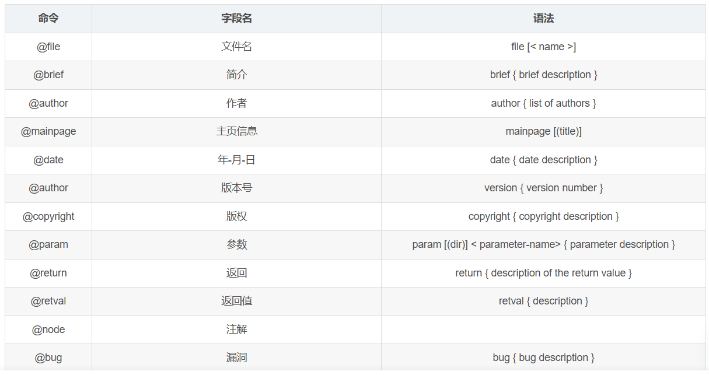
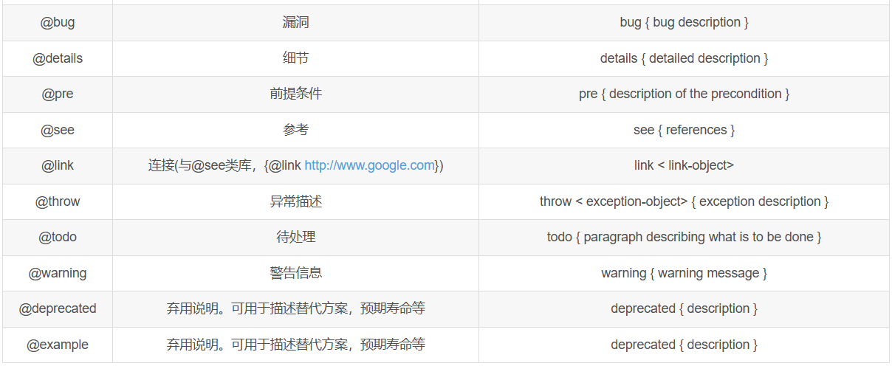
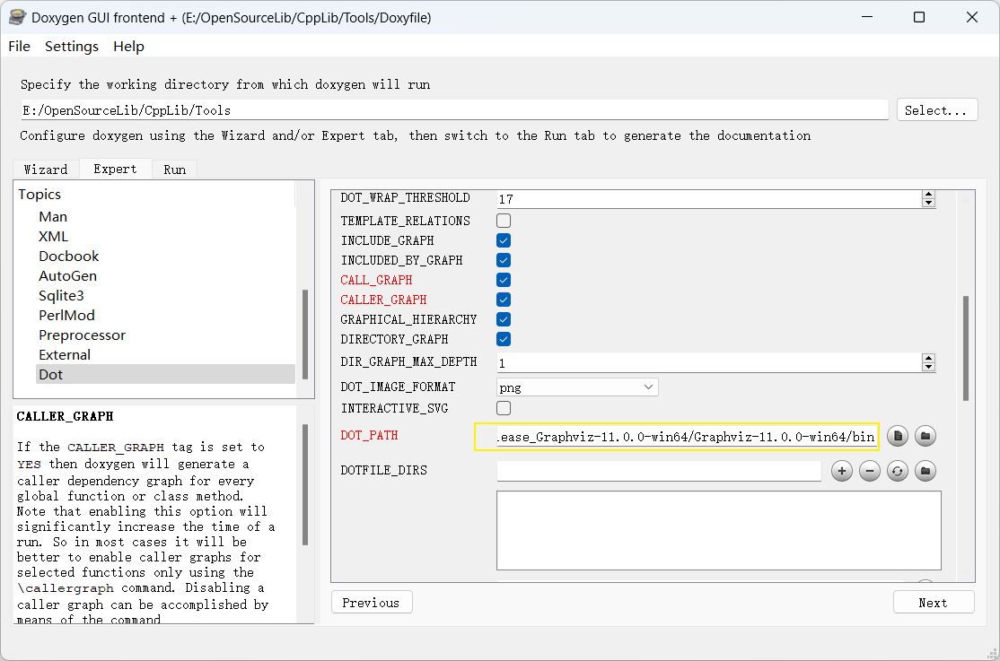

[多种-C/C++工程的文档自动生成工具 - 知乎 (zhihu.com)](https://zhuanlan.zhihu.com/p/377414780);


Doxygen主要解决说明书问题，可以在我们写代码的时候讲注释转化为说明书，Graphviz主要是用于图形展示，html help workshop主要使用生成CHM文档。
**1.Doxygen**

Doxygen能将程序中的特定批注转换成为说明文件。它可以依据程序本身的结构，将程序中按规范注释的批注经过处理生成一个纯粹的参考手册，通过提取代码结构或借助自动生成的包含依赖图（include dependency graphs）、继承图（inheritance diagram）以及协作图（collaboration diagram）来可视化文档之间的关系， Doxygen生成的帮助文档的格式可以是CHM、RTF、PostScript、PDF、HTML等。

**2.graphviz**

Graphviz(Graph Visualization Software)是一个由AT&T实验室启动的开源工具包,用于绘制DOT语言脚本描述的图形。要使用Doxygen生成依赖图、继承图以及协作图，必须先安装graphviz软件。

[Link](https://graphviz.org/download/)；

**3.HTML Help WorkShop**

微软出品的HTML Help WorkShop是制作CHM文件的最佳工具，它能将HTML文件编译生成CHM文档。Doxygen软件默认生成HTML文件或Latex文件，我们要通过HTML生成CHM文档，需要先安装HTML Help WorkShop软件，并在Doxygen中进行关联

注意：安装完后进行Doxygen配置时需要关联graphviz和HTML Help WorkShop的安装路径。


# Doxygen

示意一



## 语法





### 文件注释

```
/**
 * @file 文件名
 * @brief 简介
 * @details 细节
 * @author 作者
 * @version 版本号
 * @date 年-月-日
 * @copyright 版权
 */
```


### 结构体注释

```
/**
 * @brief 类的详细描述
 */
```


### 函数注释

```
/**
  * @brief 函数描述
  * @param 参数描述
  * @return 返回描述
  * @retval 返回值描述
  */
```


### 变量注释

```
//定义一个整型变量a
int a;

/**
 * @brief 定义一个整型变量a
*/
int a;

int a; /*!< 定义一个整型变量a */
int a; /**< 定义一个整型变量a */
int a; //!< 定义一个整型变量a
int a; ///< 定义一个整型变量a
```


## 关系图

黄框加载路径：Graphviz-11.0.0-win64低下的bin目录




## 生成PDF

所需工具

* CTex；[下载链接](https://mirrors.tuna.tsinghua.edu.cn/ctex/3.0/)；

步骤：

1. 安装打开WinEdt；
2. 打开Doxygen生成的文件（refman.tex）;
3. 编译，直接可以生成PDF，完美！

## 参考

* [下载链接](https://www.doxygen.nl/index.html)；

* [使用手册](https://www.doxygen.nl/manual/index.html)；

