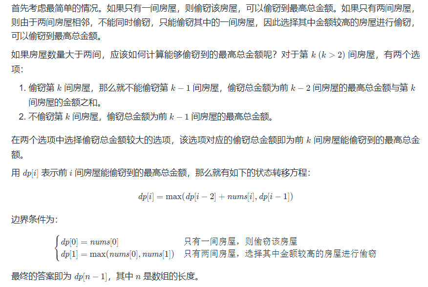
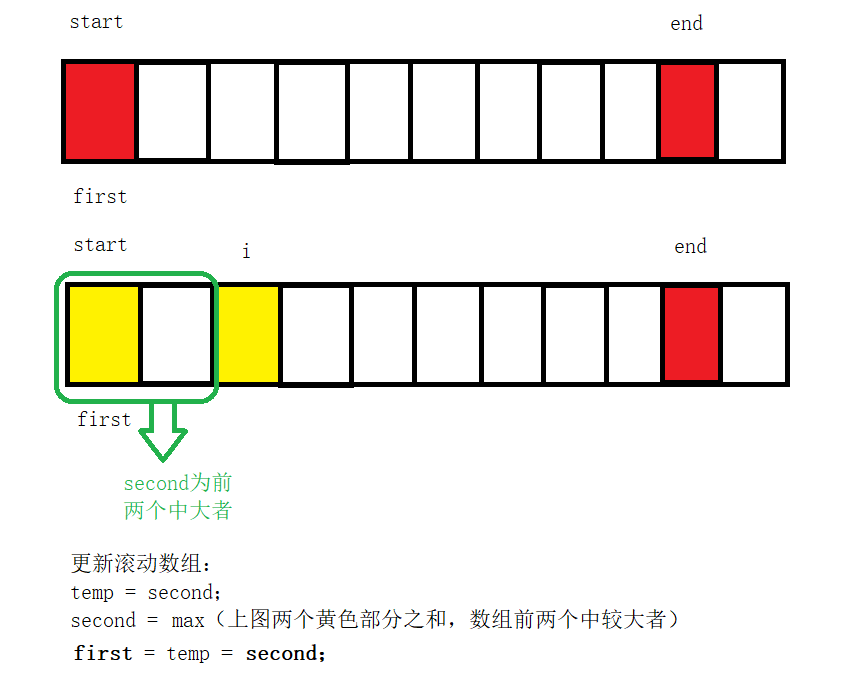

动态规划算法总结（dynamic-programming）

动态规划，常常适用于有重叠子问题和最优子结构性质的问题，并且记录所有子问题的结果，因此动态规划方法所耗时间往往远少于朴素解法。动态规划有自底向上和自顶向下两种解决问题的方式。**自顶向下即记忆化递归**，**自底向上就是递推**。使用动态规划解决的问题有个明显的特点，一旦一个子问题的求解得到结果，以后的计算过程就不会修改它，这样的特点叫做无后效性，求解问题的过程形成了一张有向无环图。动态规划只解决每个子问题一次，具有天然剪枝的功能，从而减少计算量。

# 打家劫舍

思考过程：



```c++
class Solution {
public:
    int rob(vector<int>& nums) {
        if(nums.empty()) return 0;
        int len = nums.size();
        if(len == 1) return nums[0];
        int first = nums[0];
        int second = max(nums[0], nums[1]);
        for(int i = 2; i < nums.size(); i++){
           int temp = second;
           second = max(first + nums[i], second);
           first = temp;
        }
        return second;
    }
};
```

# 打家窃舍2

此时，所有房子构成一个圆圈，即第一家和最后一家房子连接着。请分析。

分析：

1. 只有一家，只能投一家；
2. 只有两家，只能偷取最高的一家。
3. 大于两家，分区偷窃范围。假设len = nums.size() ;
   1. 若偷了第一家，则最后一家不能偷窃。偷窃范围为：[0,len-2]
   2. 若偷了最后一家，则第一家不能偷窃。偷窃范围为：[1, len-1]
4. 选择步骤三种最大金额数返回。

情况分析：



参考代码：

```c++
class Solution {
public:
    int rRange(vector<int>& nums, int start, int end)
    {
        int first = nums[start];
        int second = max(nums[start], nums[start+1]);
        for(int i = start + 2; i <= end; i++){
            int temp = second;
            second = max(first + nums[i], second);
            first = temp;
        }
        return second;
    }
    int rob(vector<int>& nums) {
        int len = nums.size();
        if(len == 1) return nums[0];
        else if(len == 2) return max(nums[0], nums[1]);
        return max(rRange(nums, 0, len-2), rRange(nums, 1, len - 1));
    }
};
```


# 删除并获得点数

[LeetCode740.删除并获得点数](https://leetcode-cn.com/problems/delete-and-earn/)。

在nums数组基础构造一个临时数组temp，这个数组是以元素的值来做下标，下标对应的元素是原来的元素的个数。

如：

> nums = [2,2,3,3,3,4];
>
> temp = [0,0,2,3,1];//表示nums中0和1各0个，2有2个，3有3个，4有1个

问题转化为打家窃舍问题，

> 打家窃舍最优结构：dp[i] = Math.max(dp[i - 1], dp[i - 2] + nums[i]);
>
> 此问题最优结构：  dp[i] = Math.max(dp[i - 1], dp[i - 2] + i * all[i]);

```c++
class Solution {
public:
    int deleteAndEarn(vector<int>& nums) {
        if(nums.size() < 1) return 0;
        int maxVal = 0;
        for(auto e: nums){
            maxVal = max(maxVal, e);//确定数组长度
        }
        vector<int> count(maxVal+1), dp(maxVal+1);
        for(auto val: nums){
            count[val]++; //temp数组
        }
        dp[1] = count[1];
        for(int i = 2; i <= maxVal; i++){
            dp[i] = max(dp[i-1], dp[i-2] + count[i]*i);
        }
        return dp[maxVal];
    }
};
```

# 跳跃游戏

[LeetCode55.跳跃游戏](https://leetcode-cn.com/problems/jump-game/)

分析：

> 1. 找出最远可以到达的最右位置
> 2. 如果最远可到达最右位置超过nums数组最后一个元素 返回true，否则返回false；

```c++
class Solution {
public:
    bool canJump(vector<int>& nums) {
        int n = nums.size();
        int rightMax = 0;
        for(int i = 0; i < n; i++){
            if(i <= rightMax){
                rightMax = max(rightMax, i+nums[i]);//记录最远到达
                if(rightMax >= n-1)
                    return true;
            }
        }
        return false;
    }
};
```


# 跳跃游戏2

目标：使用最少跳跃次数到达数组的最后一个位置

## 反向查找

考虑最后一步跳跃前所在位置，通过该位置可以跳跃到最后一个位置。如果有多个位置都能跳跃到最后一个位置，那么应该选择距离最后一个位置最远的位置，即对应下标最小的位置。所以，从左向右遍历数组，选择第一个满足要求的位置。确定最后一步跳跃前所在位置之后，贪心的选择倒数第二步跳跃前所在位置，依次类推，直到找到最开始位置。

```java
class Solution {
    public int jump(int[] nums) {
        int position = nums.length - 1;
        int steps = 0;
        while (position > 0) {
            for (int i = 0; i < position; i++) {
                if (i + nums[i] >= position) {
                    position = i;
                    steps++;
                    break;
                }
            }
        }
        return steps;
    }
}

作者：LeetCode-Solution
链接：https://leetcode-cn.com/problems/jump-game-ii/solution/tiao-yue-you-xi-ii-by-leetcode-solution/
来源：力扣（LeetCode）
著作权归作者所有。商业转载请联系作者获得授权，非商业转载请注明出处。
```

## 正向查找

正向查找，每次查找最远可到达位置

```
class Solution {
public:
    int jump(vector<int>& nums) {
        int maxPos = 0, len = nums.size(), end = 0, sumStep = 0;
        for(int i = 0; i < len -1; i++){
            if(maxPos >= i){
                maxPos = max(maxPos, i + nums[i]);
                if(i == end){
                    end = maxPos;
                    ++sumStep;
                }
            }
        }
        return sumStep;
    }
};
```

时间复杂度：$O(n)$，n为数组长度。

空间复杂度：$O(1)$。


# 27-11-10

组长：

进程组组长：命令行上启动的多个进程，协同完成某种任务，其中第一个被创建出来的进程，称之为组长进程。

守护进程本质也是孤儿进程。

会话首进程有权限打开终端。

ps axj | head -1 && ps axj | grep 文件名 

killall 进程名称  杀掉进程 

ls /dev/null  -al字符文件、设备；所有设备往这个文件写，等于丢弃这个文件，通常用来进行屏蔽，drop输入输出信息。

```c
//void deamon(int nochidr , int noclose)
int main()
{
    umask(0);// sys/type.h sys/stat.h
    if(fork()>0){
        exit(0);
    }
    signal(SIGCHLD, SIG_IGN);
    setsid();//将非组长进程设为新的独立会话
    //if语句，可以选择不做，防御性编程
    if(fork()>0){
        //father
        exit(0);
    }
    
    //可选择选项
    chdir("/");//修改当前路径为根目录，无法打开终端设备
    
    if(nochld == 0)
    {
        //可选择选项
    	chdir("/");//修改当前路径为根目录，无法打开终端设备
    }
    
    //可选择选项
    close(0);
    int fd = open("dev/null", O_RDWR);
    if(fd < 0){return;}
    dup2(fd, 1);
    dup2(fd, 2);
    
    if(noclose == 0)
    {
        close(0);
        int fd = open("dev/null", O_RDWR);
        if(fd < 0){return;}
        dup2(fd, 1);
        dup2(fd, 2);
    }
    
    //走到此处，孙子进程执行
    while(1){
    }
    return 0;
}
int main()
{
    my_daemon(1,1);
    while(1){
        sleep(1);
    }
}
```

ls /proc/进程编号/fd 

PGRP标记进程组组长编号

父进程就是组长，


# 线程

线程在进程内部运行，线程在进程地址空间内运行。

in Linux，站在CPU的角度，能否识别task_struct是进程还是线程？？

什么是进程？（站在内核角度）

​	承担分配系统资源的基本单位 称之为进程。 进程分配task_struct 和地址空间；

**之前对进程的理解**，所有进程都是只有一个task_struct ，该进程内部只有一个执行流。【单执行流进程】

站在CPU的角度，in Linux，站在CPU的角度，能否识别task_struct是进程还是线程？？【不能，也不需要识别，因为，CPU只关心一个一个的独立执行流。在CPU看来，task_struct <= OS原理上面的进程控制块的】

在linux下，并不存在真正的多线程，其实是用进程模拟的线程。怎么理解？当线程足够多时，操作系统需要管理线程。

Linux中，所有执行流，都叫做轻量级进程。

```
NAME
       pthread_create - create a new thread

SYNOPSIS
       #include <pthread.h>

       int pthread_create(pthread_t *thread, const pthread_attr_t *attr,
                          void *(*start_routine) (void *), void *arg);

       Compile and link with -pthread.

DESCRIPTION
       The  pthread_create()  function starts a new thread in the calling process.  The new
       thread starts execution by invoking start_routine(); arg is passed as the sole argu‐
       ment of start_routine().
       
       pthread_create() 函数在调用进程中启动一个新线程。 新线程通过调用 start_routine() 开始执行； arg 作为 	     start_routine() 的唯一参数传递。 

       The new thread terminates in one of the following ways:

       * It  calls  pthread_exit(3),  specifying  an exit status value that is available to
         another thread in the same process that calls pthread_join(3).

       * It returns from start_routine().  This is equivalent  to  calling  pthread_exit(3)
         with the value supplied in the return statement.

       * It is canceled (see pthread_cancel(3)).

       * Any  of  the  threads  in the process calls exit(3), or the main thread performs a
         return from main().  This causes the termination of all threads in the process.

```


从系统理解char *str = "hello yumoz"; str[1] = "o";出错原因。因为物理内存到栈的映射关系出现问题。


计算密集型：执行流的大部分任务，主要以计算为主：加密解密、排序

IO密集型：执行流的大部分任务，是以IO为主，刷磁盘，访问数据库，访问网络。


作业笔记

# 一、第一天

## 1 字母变换

大写变小写、小写变大写 : 字符 ^= 32;

大写变小写、小写变小写 : 字符 |= 32;

小写变大写、大写变大写 : 字符 &= -33;

例如：

> ASCII码表中大写的A是65，小写的a是97，它们的差是32
>
> 65 | 32 转为二进制（按8位来算）可以得到 0100 0001 | 0010 0000 = 0110 0001 = 97 = a


# 二、day2

## 搜索插入位置

[题目链接]: https://leetcode-cn.com/problems/search-insert-position/


```c
int searchInsert(int* nums, int numsSize, int target){
    int left = 0;
    int right = numsSize - 1;
    int ans = numsSize;

    while(left <= right)
    {
        int mid = ((right - left) >> 1)  + left;
        if(target <= nums[mid])
        {
            ans = mid;
            right = mid - 1;
        }
        else
        {
            left = mid + 1;
        }
    }    
    return ans;
}
```


# 三、day3

