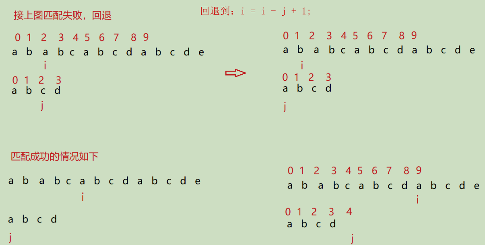

# 字符串相关练习


## 字符串匹配算法

### 暴力算法



```c++
#include <stdio.h>
#include <string.h>
#include <assert.h>
//暴力匹配方法
// str 主串 sub 子串
int BF(char *str, char *sub)
{
	assert(str != NULL && sub != NULL);
	if (str == NULL || sub == NULL)
	{
		return -1;
	}

	int i = 0;
	int j = 0;
	int strLen = strlen(str);
	int subLen = strlen(sub);
	while (i < strLen && j < subLen)
	{
		if (str[i] == sub[j])
		{
			i++;
			j++;
		}
		else //回退
		{
			i = i - j + 1;  // 注意回退的是多少
			j = 0;
		}
	}
	if (j >= subLen)
	{
		return i - j;
	}
	return -1;
}
int main()
{
	printf("%d\n", BF("ababcabcdabcde", "abcd"));
	printf("%d\n", BF("ababcabcdabcde", "abcde"));
	printf("%d\n", BF("ababcabcdabcde", "abcdef"));
	return 0;
}
```

###  KMP算法

（参考PDFKMP算法）

引出next数组
KMP 的精髓就是 next 数组：也就是用 next[j] = k;来表示，不同的 j 来对应一个 K 值， 这个 K 就是你将来要移动的 j要移动的位置。
而 K 的值是这样求的：

* 规则：找到匹配成功部分的两个相等的真子串（不包含本身），一个以下标 0 字符开始，另一个以 j-1 下标字符结尾。
* 不管什么数据 next[0] = -1;next[1] = 0;在这里，我们以下标来开始，而说到的第几个第几个是从 1 开始；


# 17电话号码的组合

[电话号码的字母组合](https://leetcode-cn.com/problems/letter-combinations-of-a-phone-number/)，

题目描述：给定一个仅包含数字2-9的字符串，返回所有它能表示的字母组合。答案可以按任意顺序返回。数字和字母对应的映射如下。

示例 1：

输入：digits = "23"
输出：["ad","ae","af","bd","be","bf","cd","ce","cf"]
示例 2：

输入：digits = ""
输出：[]
示例 3：

输入：digits = "2"
输出：["a","b","c"]


## unorder_map思路


```C++
class Solution {
public:
    vector<string> letterCombinations(string digits) {
        vector<string> combinations;
        if (digits.empty()) {
            return combinations;
        }
        unordered_map<char, string> phoneMap{
            {'2', "abc"},
            {'3', "def"},
            {'4', "ghi"},
            {'5', "jkl"},
            {'6', "mno"},
            {'7', "pqrs"},
            {'8', "tuv"},
            {'9', "wxyz"}
        };
        string combination;
        backtrack(combinations, phoneMap, digits, 0, combination);
        return combinations;
    }

    void backtrack(vector<string>& combinations, const unordered_map<char, string>& phoneMap, const string& digits, int index, string& combination) {
        if (index == digits.length()) {
            combinations.push_back(combination);
        } else {
            char digit = digits[index];
            const string& letters = phoneMap.at(digit);
            for (const char& letter: letters) {
                combination.push_back(letter);
                backtrack(combinations, phoneMap, digits, index + 1, combination);
                combination.pop_back();
            }
        }
    }
};

作者：LeetCode-Solution
链接：https://leetcode-cn.com/problems/letter-combinations-of-a-phone-number/solution/dian-hua-hao-ma-de-zi-mu-zu-he-by-leetcode-solutio/
来源：力扣（LeetCode）
著作权归作者所有。商业转载请联系作者获得授权，非商业转载请注明出处。
```


## 解法二 vector & string

```C++
class Solution {
public:
    vector<string> phone={"", "", "abc", "def", "ghi", "jkl", "mno", "pqrs", "tuv", "wxyz"};
    vector<string> letterCombinations(string digits) {
        if(digits.size() == 0) return {};
        vector<string> res; 
        res.push_back("");
        for(char digit : digits)
        { 
            vector<string> temp;
            for(string s : res) // s是前面一轮字符选择结果
            {
                for(char candidate : phone[digit - '0']) //candidate 是本轮待选择的字符
                {
                    temp.push_back(s + candidate);
                }
            }
            res.swap(temp); //交换temp 和 res 
        }
        return res;
    }
};
```


理解swap


