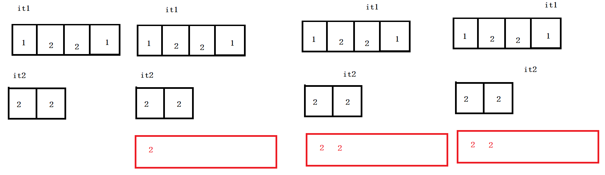
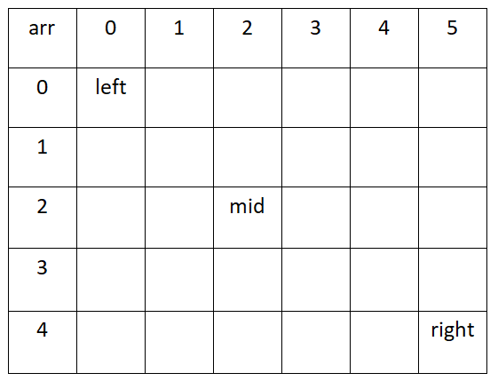
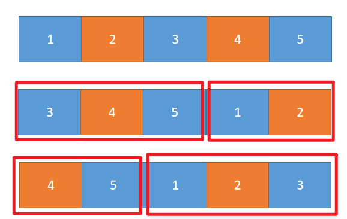

# 题目-两个数组的交集

LeetCode349

[两个数组的交集](https://leetcode-cn.com/problems/intersection-of-two-arrays/)

给定两个数组，编写一个函数来计算它们的交集。


实例：

```
输入：nums1 = [4,9,5], nums2 = [9,4,9,8,4]
输出：[9,4]
```

## 分析

借助示例

```
输入：nums1 = [1,2,2,1], nums2 = [2,2]
输出：[2]
```

分析结果如下图：

两个迭代器指针从头开始比较，

1. 若不相等，小得就是差异集合，然后**小的向后走一步**；
2. 若相等，就是交集的成员，**两个指针一起向后走**。
3. 红色框表示自己的vector，用来存放需要返回的交集。



## 参考解法

```C++
class Solution {
public:
    vector<int> intersection(vector<int>& nums1, vector<int>& nums2) {
        set<int> s1;
        for(auto e: nums1)
            s1.insert(e);//s1 set

        set<int> s2;
        for(auto e: nums2)
            s2.insert(e); //s2 set

        vector<int> vRet;//存放返回数组
        auto it1 = s1.begin();
        auto it2 = s2.begin();
        while(it1 != s1.end() && it2 != s2.end()){
            if(*it1 < *it2)
                it1++;
            else if(*it1 > *it2)
                it2++;
            else
            {
                vRet.push_back(*it2);
                it1++;
                it2++;
            }
        }  
        return vRet;
    }
};
```


# 题目-合并两个有序数组

LeetCode88

## 直接合并+排序

```c++
class Solution {
public:
    void merge(vector<int>& nums1, int m, vector<int>& nums2, int n) {
        for (int i = 0; i != n; ++i) {
            nums1[m + i] = nums2[i];
        }
        sort(nums1.begin(), nums1.end());
    }
};
```

## 双指针

1. 利用已知数组已经排序性质完成下列问题


```C++
class Solution {
public:
    void merge(vector<int>& nums1, int m, vector<int>& nums2, int n) {
        int p1 = 0;
        int p2 = 0;
        int sorted[m+n];
        int cur; //记录当前值，用于插入sorted数组中
        while(p1 < m || p2 < n)
        {
            if(p1 == m) //排完nums1
            {
                cur = nums2[p2++];
            }
            else if(p2 == n)
            {
                cur = nums1[p1++];
            }
            else if(nums1[p1] < nums2[p2])
            {
                cur = nums1[p1++];
            }
            else 
            {
                cur = nums2[p2++];
            }
            sorted[p1+p2-1] = cur;
        }
        for(int i = 0; i != m+n; ++i)
        {
            nums1[i] = sorted[i];
        }
    }
};
```

# 题目-有序数组的平方

977

##  排序


```c++
class Solution {
public:
    vector<int> sortedSquares(vector<int>& nums) {
        vector<int> ans;
        for (int num: nums) {
            ans.push_back(num * num);
        }
        sort(ans.begin(), ans.end());
        return ans;
    }
};
```


## 双指针

作者：LeetCode-Solution
链接：https://leetcode-cn.com/problems/squares-of-a-sorted-array/solution/you-xu-shu-zu-de-ping-fang-by-leetcode-solution/
来源：力扣（LeetCode）
著作权归作者所有。商业转载请联系作者获得授权，非商业转载请注明出处。

```C++
class Solution {
public:
    vector<int> sortedSquares(vector<int>& nums) {
        int n = nums.size();
        int negative = -1;
        for (int i = 0; i < n; ++i) {
            if (nums[i] < 0) {
                negative = i;
            } else {
                break;
            }
        }

        vector<int> ans;
        int i = negative, j = negative + 1;
        while (i >= 0 || j < n) {
            if (i < 0) {
                ans.push_back(nums[j] * nums[j]);
                ++j;
            }
            else if (j == n) {
                ans.push_back(nums[i] * nums[i]);
                --i;
            }
            else if (nums[i] * nums[i] < nums[j] * nums[j]) {
                ans.push_back(nums[i] * nums[i]);
                --i;
            }
            else {
                ans.push_back(nums[j] * nums[j]);
                ++j;
            }
        }

        return ans;
    }
};
```


## 双指针

同样地，我们可以使用两个指针分别指向位置 00 和 n-1n−1，每次比较两个指针对应的数，选择较大的那个逆序放入答案并移动指针。这种方法无需处理某一指针移动至边界的情况，读者可以仔细思考其精髓所在。

```C++
class Solution {
public:
    vector<int> sortedSquares(vector<int>& nums) {
        int n = nums.size();
        vector<int> ans(n);
        for (int i = 0, j = n - 1, pos = n - 1; i <= j;) {
            if (nums[i] * nums[i] > nums[j] * nums[j]) {
                ans[pos] = nums[i] * nums[i];
                ++i;
            }
            else {
                ans[pos] = nums[j] * nums[j];
                --j;
            }
            --pos;
        }
        return ans;
    }
};
```

作者：LeetCode-Solution
链接：https://leetcode-cn.com/problems/squares-of-a-sorted-array/solution/you-xu-shu-zu-de-ping-fang-by-leetcode-solution/
来源：力扣（LeetCode）
著作权归作者所有。商业转载请联系作者获得授权，非商业转载请注明出处。

#  题一

[题目链接](https://www.nowcoder.com/practice/abc3fe2ce8e146608e868a70efebf62e)

在一个二维数组array中（每个一维数组的长度相同），每一行都按照从左到右递增的顺序排序，每一列都按照从上到下递增的顺序排序。请完成一个函数，输入这样的一个二维数组和一个整数，判断数组中是否含有该整数。

[

[1,2,8,9],
[2,4,9,12],
[4,7,10,13],
[6,8,11,15]

]

给定 target = 7，返回 true。

给定 target = 3，返回 false。


## 暴力遍历法

```C++
class Solution {
public:
    bool Find(int target, vector<vector<int> > array) {
        //暴力遍历
        if(array.size() == 0 || array[0].size() == 0) 
            return false;
        for(const auto& vec : array){
            for(const auto& val : vec){
                if(val == target)
                    return true;
            }
        }
        return false;//未找到
    }
};
```

## 二分法

参考一维数组二分法思路，假设对于二维数组也成立。



判断target和mid位置数字大小，作比较。

查找的过程本质就是排除过程，谁排除多，选谁。

```c++
class Solution {
public:
        // 二分法搜索
     bool BinarySearch(vector<int> arr,int target)
     {
         int left = 0,right = arr.size()-1;
         //[left,right]
         while(left <= right)
         {
             int mid = left + ((right-left)>>1);
             if(arr[mid] == target) 
                 return true;
             else if(arr[mid] < target) 
                 left = mid + 1; //右边找
             else 
                 right = mid - 1; //左边找
         }
         return false;
     }
    bool Find(int target, vector<vector<int> > array) 
    {
        //解法二：二分法解答过程
        for(auto e : array)
        {
            if(BinarySearch(e, target)) return true;
        }
        return false;
    }
};
```


思路参考代码

| arr  | 0    | 1    | 2    | 3    | 4    | 5    |
| ---- | ---- | ---- | ---- | ---- | ---- | ---- |
| 0    |      |      |      |      |      | val  |
| 1    |      |      |      |      |      |      |
| 2    |      |      |      |      |      |      |
| 3    |      |      |      |      |      |      |
| 4    |      |      |      |      |      |      |

其中val左边的小于val，val下边的大于val，比较规则如下

1. 若target > val ，表明target在更大位置，所以行加一，向下移动查询
2. 若target < val ，表明target在更小位置，所以列减一，向左移动查询

```c++
class Solution {
public:
    bool Find(int target, vector<vector<int> > array) {
        int i = 0;
        int j = array[0].size() - 1;//第一行最右元素，表示第一行最大元素
        
        while(i < array.size() && j >= 0){
            if(target < array[i][j]) //array[i][j]为当前行最大，当前列最小
                j--;//列前移
            else if(target > array[i][j])
                i++; //行下移动
            else
                return true;
        }
        return false;
    }
};
```

复杂度分析：

> 其中时间复杂度：O(m+n),对应于m行，n列的移动次数
>
> 空间复杂度为1，因为使用一个变量val


# 题二 旋转数组的最小数字

把一个数组最开始的若干个元素搬到数组的末尾，我们称之为数组的旋转。 输入一个非递减排序的数组的一个旋
转，输出旋转数组的最小元素。 

例如数组{3,4,5,1,2}为{1,2,3,4,5}的一个旋转，该数组的最小值为1。 

NOTE：给出的所有元素都大于0，若数组大小为0，请返回0。

## 暴力解法

强行遍历数组，找出最小值。没有用到题目已给的含义，非降序，旋转等关键字。

```c++
class Solution {
public:
    int minNumberInRotateArray(vector<int> rotateArray) {
        //暴力解法
        int val = rotateArray[0];
        for(const auto& arr : rotateArray){
            if(arr < val)
                val = arr;
        }
        return val;
    }
};

class Solution {
public:
    int minNumberInRotateArray(vector<int> rotateArray) {
        //暴力解法
        if(rotateArray.empty()) return 0;
        for(int i = 0; i < rotateArray.size()-1; i++){
            if(rotateArray[i] > rotateArray[i+1])
                return rotateArray[i+1];
        }
        return rotateArray[0];
    }
};
```

## 二分查找



因为数组非递减，旋转后分为两部分，左半部分非递减，有半部分非递减。并且，前半部分整体大于后半部分。所以掌握此规律，继续查找，定义left指向最左侧，right指向最右侧，mid指向中间位置。若：

1. arr[mid] >= arr[left] 说明mid位置在原数组前半部分，进一步说明，目标最小值，在mid的右侧，让left=mid
2. arr[mid] < arr[left] 说明mid位置在原数组后半部分，进一步说明，目标最小值，在mid的左侧，让right=mid

参考代码：

```c++
class Solution {
public:
    int minNumberInRotateArray(vector<int> rotateArray) {
        //二分法
        if(rotateArray.empty()) return 0;
        
        int left = 0;
        int right = rotateArray.size() - 1;
        int mid = 0;
        while(rotateArray[left] >= rotateArray[right]){
            if(right - left == 1){    //表明左右两数相邻
                mid = right;
                break;
            }
            mid = left + ((right - left) >> 1);
            
            //无法判断目标在mid左侧还是右侧
            if(rotateArray[mid] == rotateArray[left] && 
               rotateArray[right] == rotateArray[left]){
                int res = rotateArray[left];
                for(int i = left+1; i<right; i++){
                    if(res > rotateArray[i])
                        res = rotateArray[i];
                }
                return res;
            }
            
            //判断来自左边还是右边
            if(rotateArray[mid] >= rotateArray[left])    //mid在左半部分
                left = mid;
            else    //mid在有半部分
                right = mid;
        }//end of while
        return rotateArray[mid];
    }
};
```


# 题三 调整数组顺序使奇数位位于偶数位前面


## 辅助数组

```C++
class Solution {
public:
    void reOrderArray(vector<int> &array) {
        //辅助数组 空间
        vector<int> vec;
        for(const int& v : array){
            if(v & 1) vec.push_back(v);//将奇数插入vec中
        }
        for(const int& v: array){
            if(!(v & 1)) vec.push_back(v);//后面继续插入vec中
        }
        //将vec拷贝到array
        copy(vec.begin(), vec.end(), array.begin()); 
    }
};
```


## 思路

in-place


使用插入排序的思想，但是我觉得这个代码有点缺陷。

```c++
class Solution {
public:
    void reOrderArray(vector<int> &array) {
        //插入排序思路
        int k = 0;//标记奇数下标位置
        for(int i = 0; i <  array.size(); i++){
            if((array[i] & 1) == 1){ //奇数
                int temp = array[i]; //记录此数
                int j = i; //记录奇数位置的下标
                while(j > k){
                    array[j] = array[j-1]; // 将奇数前面的偶数移动
                    j--;
                }
                array[k++] = temp;
            }
        }
    }
};
```


```C++
class Solution {
public:
  void reOrderArray(vector<int> &array) {
      int i = 0;
      for (int j=0; j<array.size(); ++j) {
          if (array[j]&1) {
              int tmp = array[j];
              for (int k=j-1; k>=i; --k) {
                  array[k+1] = array[k];
              }
              array[i++] = tmp;
          }
      }
  }
};
```

