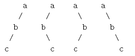

# per-post

[题目链接](https://www.nowcoder.com/questionTerminal/89844f1f632c475ab6f4a600f71683a8)

We are all familiar with pre-order, in-order and post-order traversals of binary trees. A common problem in data structure classes is to find the pre-order traversal of a binary tree when given the in-order and post-order traversals. Alternatively, you can find the post-order traversal when given the in-order and pre-order. However, in general you cannot determine the in-order traversal of a tree when given its pre-order and post-order traversals. Consider the four binary trees below:

我们都熟悉二叉树的前序、有序和后序遍历。数据结构类中的一个常见问题是，在给定有序和有序遍历时，如何找到二叉树的前序遍历。或者，您可以在给定in-order和pre-order时找到post-order遍历。但是，一般情况下，当给定树的前序和后序遍历时，您不能确定树的in-order。考虑下面的四棵二叉树:



All of these trees have the same pre-order and post-order traversals. This phenomenon is not restricted to binary trees, but holds for general m-ary trees as well.

所有这些树具有相同的前序和后序遍历。这种现象不仅限于二叉树，也适用于一般的m叉树。

输入描述：

> Input will consist of multiple problem instances. Each instance will consist of a line of the form m s1 s2, indicating that the trees are m-ary trees, s1 is the pre-order traversal and s2 is the post-order traversal.All traversal strings will consist of lowercase alphabetic characters. For all input instances, 1 <= m <= 20 and the length of s1 and s2 will be between 1 and 26 inclusive. If the length of s1 is k (which is the same as the length of s2, of course), the first k letters of the alphabet will be used in the strings. An input line of 0 will terminate the input.
>
> 输入将包含多个问题实例。每个实例将由一行形式为 m s1 s2的行组成，表示树是 m 元树，s1是前序遍历，s2是后序遍历。所有遍历字符串将由小写字母组成。对于所有输入实例，1 < = m < = 20，s1和 s2的长度介于1和26之间。如果 s1的长度是 k (当然这和 s2的长度是一样的) ，字符串中将使用字母表中的第一个 k 字母。输入行0将终止输入。

输出描述：

> For each problem instance, you should output one line containing the number of possible trees which would result in the pre-order and post-order traversals for the instance. All output values will be within the range of a 32-bit signed integer. For each problem instance, you are guaranteed that there is at least one tree with the given pre-order and post-order traversals.
>
> 对于每个问题实例，您应该输出一行，其中包含可能导致实例的pre-order 和post-order遍历的树的数量。所有输出值都在32位带符号整数的范围内。对于每个问题实例，可以保证至少有一棵树具有给定的预排序和后排序遍历。

示例：

> 输入：
>
> > > ```C
> > > 2 abc cba
> > > 2 abc bca
> > > 10 abc bca
> > > 13 abejkcfghid jkebfghicda
> > > ```
>
> 
>
> 输出：
>
> > ```
> > 4
> > 1
> > 45
> > 207352860
> > ```
> >
> > 

