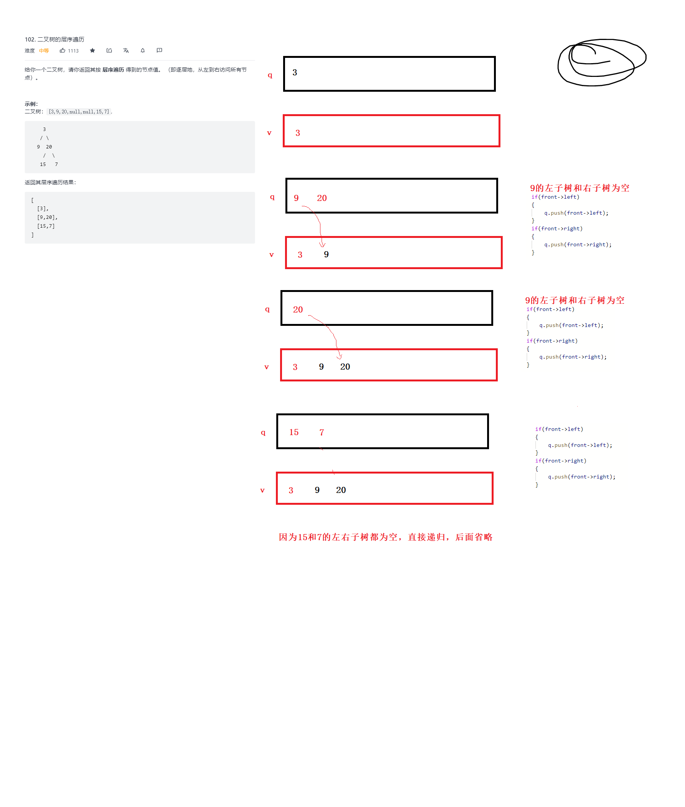

# 二叉树的层序遍历

[题目链接](https://leetcode-cn.com/problems/binary-tree-level-order-traversal)

给你一个二叉树，请你返回其按 **层序遍历** 得到的节点值。 （即逐层地，从左到右访问所有节点）。

示例：
二叉树：[3,9,20,null,null,15,7],

    3
   / \
  9  20
    /  \
   15   7
返回其层序遍历结果：

[
  [3],
  [9,20],
  [15,7]
]


代码：

```C++
/**
 * Definition for a binary tree node.
 * struct TreeNode {
 *     int val;
 *     TreeNode *left;
 *     TreeNode *right;
 *     TreeNode() : val(0), left(nullptr), right(nullptr) {}
 *     TreeNode(int x) : val(x), left(nullptr), right(nullptr) {}
 *     TreeNode(int x, TreeNode *left, TreeNode *right) : val(x), left(left), right(right) {}
 * };
 */
class Solution {
public:
    vector<vector<int>> levelOrder(TreeNode* root) {       
        if(root == nullptr) //root为空
            return vector<vector<int>>();

        queue<TreeNode*> q; //队列
        int levelSize = 1;
        q.push(root); //push根结点
        vector<vector<int>> vv; 
        while(!q.empty()) //队列不为空
        {
            //按层出
            vector<int> v;
            for(int i = 0; i < levelSize; ++i)
            {
                TreeNode* front = q.front();
                q.pop();
                v.push_back(front->val);

                if(front->left)
                {
                    q.push(front->left);
                }
                if(front->right)
                {
                    q.push(front->right);
                }
            }
            //出完一层，下一层入队列
            levelSize = q.size();
            vv.push_back(v);
        }
        return vv;
    }
};
```


