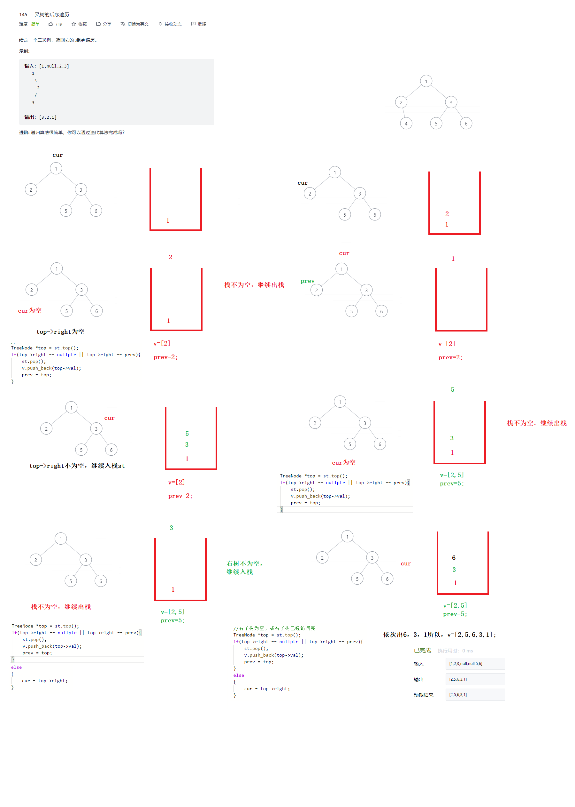

# 二叉树的后序遍历

[题目链接](https://leetcode-cn.com/problems/binary-tree-postorder-traversal/submissions/)

## 非递归参考代码

分析图：



```c++
/**
 * Definition for a binary tree node.
 * struct TreeNode {
 *     int val;
 *     TreeNode *left;
 *     TreeNode *right;
 *     TreeNode() : val(0), left(nullptr), right(nullptr) {}
 *     TreeNode(int x) : val(x), left(nullptr), right(nullptr) {}
 *     TreeNode(int x, TreeNode *left, TreeNode *right) : val(x), left(left), right(right) {}
 * };
 */
class Solution {
public:
    vector<int> postorderTraversal(TreeNode* root) {
        TreeNode *cur = root;
        vector<int> v;
        stack<TreeNode*> st;
        TreeNode *prev = nullptr;

        while(cur != nullptr || !st.empty()){
            while(cur){
                st.push(cur);
                cur = cur->left;
            }

            //右子树为空，或右子树已经访问完
            TreeNode *top = st.top();
            if(top->right == nullptr || top->right == prev){
                st.pop();
                v.push_back(top->val);
                prev = top;
            }
            else
            {
                cur = top->right;
            }
        }
        return v;
    }
};
```

时间复杂度为$O(n)$，空间复杂度$O(n)$；

