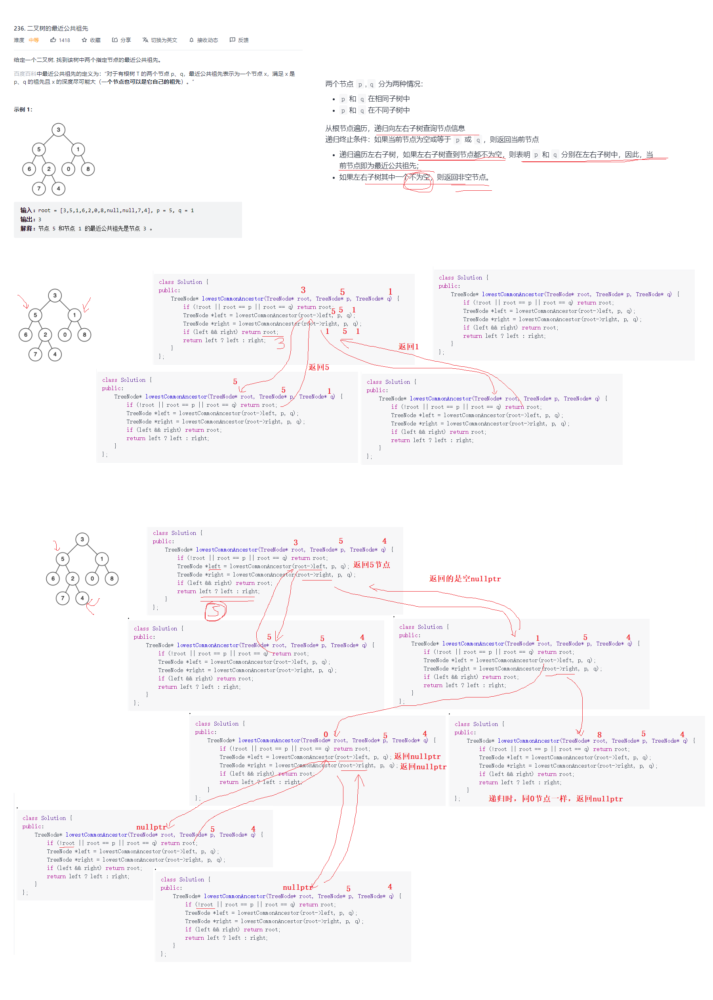

# 题目

[LeetCode题目链接](https://leetcode-cn.com/problems/lowest-common-ancestor-of-a-binary-tree/submissions/)

# 递归法参考

```
/**
 * Definition for a binary tree node.
 * struct TreeNode {
 *     int val;
 *     TreeNode *left;
 *     TreeNode *right;
 *     TreeNode(int x) : val(x), left(NULL), right(NULL) {}
 * };
 */
class Solution {
public:
    TreeNode* lowestCommonAncestor(TreeNode* root, TreeNode* p, TreeNode* q) {
        //1.根结点为空，或根结点是其中一个或两个节点 返回 根结点
        if(root == nullptr || root == p || root == q)
            return root;
        
        //2. 递归遍历左右子树，找节点
        TreeNode *left = lowestCommonAncestor(root->left, p, q);
        TreeNode *right = lowestCommonAncestor(root->right, p, q);

        //3.若left且right不空，说明p，q就分布在左右子树中
        if(left != nullptr && right != nullptr)
            return root;
        else if((left != nullptr && right == nullptr) || (left == nullptr && right != nullptr) )
        {
            //4. 若左右子树其中一个不空，就返回此非空节点
            return left ? left : right;
        }
        return nullptr;        
    }
};
```

参考思路图：

[参考思路](https://leetcode-cn.com/problems/lowest-common-ancestor-of-a-binary-tree/solution/236-er-cha-shu-de-zui-jin-gong-gong-zu-xian-jian-j/)：点击链接



